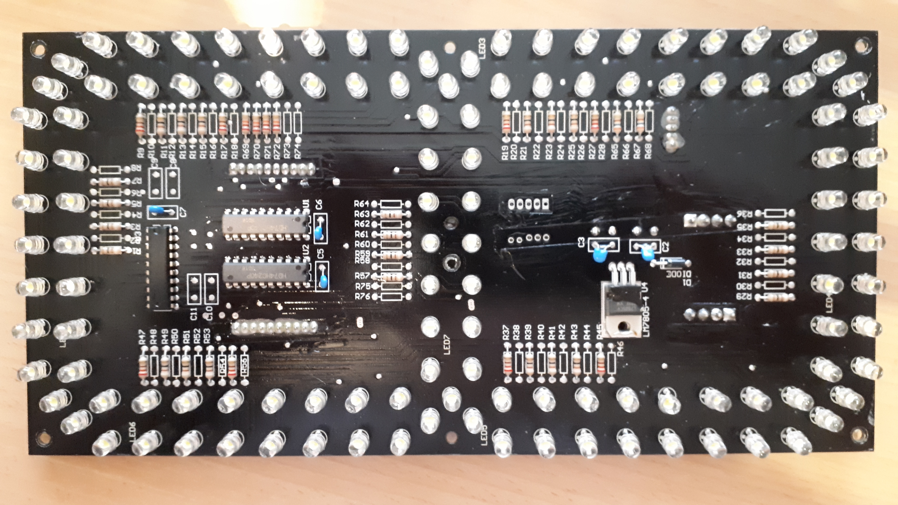

Was ist der TW-1264?
===

TW-1264 ist eine Platine mit LEDs, die als 7-Segment-Anzeige angeordnet sind. Solche Ziffern werden beispielsweise an Tankstellen verwendet, um den Preis anzuzeigen.

Jedes Segment besteht aus 16 weißen LEDs.

Dazu gibt es eine Platine mit der Bezeichnung TW-1222, die einen Punkt aus 4 LEDs liefert, vermutlich das Komma als Trennzeichen zwischen Euro und Cent.

Belegung
===

Spannungsversorgung: 12 V

Signal: 5 V

* JP1 ("Input") Pin 1: `GND`
* JP1 ("Input") Pin 2: `SRCK`
* JP1 ("Input") Pin 3: `G`
* JP1 ("Input") Pin 4: `SERIN`
* JP1 ("Input") Pin 5: ?
* JP1 ("Input") Pin 5: ?
* JP1 ("Input") Pin 7: `RCK`
* JP1 ("Input") Pin 8: ?
* JP1 ("Input") Pin 9: ?
* JP1 ("Input") Pin 10: `GND`

Wie ich dazu kam, steht in der [Analyse](./getting-started/Analyse.md).

Mögliches Zubehör
===

[Noch nicht überprüft!]

10-poliger PlatinenSteckverbinder für `JP1` und `JP2`, [Reichelt, Best. Nr. PS 25/10G WS](https://www.reichelt.de/platinensteckverbinder-gerade-weiss-10-polig-ps-25-10g-ws-p14824.html?ACTION=3;ARTICLE=14824;SEARCH=PS%2025/10G%20WS), 25 cm lang, 1,25 €

5-poliger PlatinenSteckverbinder für `JP3`, [Reichelt, Best. Nr. PS 25/5G WS](https://www.reichelt.de/platinensteckverbinder-gerade-weiss-5-polig-ps-25-5g-ws-p14829.html?&trstct=lsbght_sldr::14824), 25 cm lang, 0,60 €

