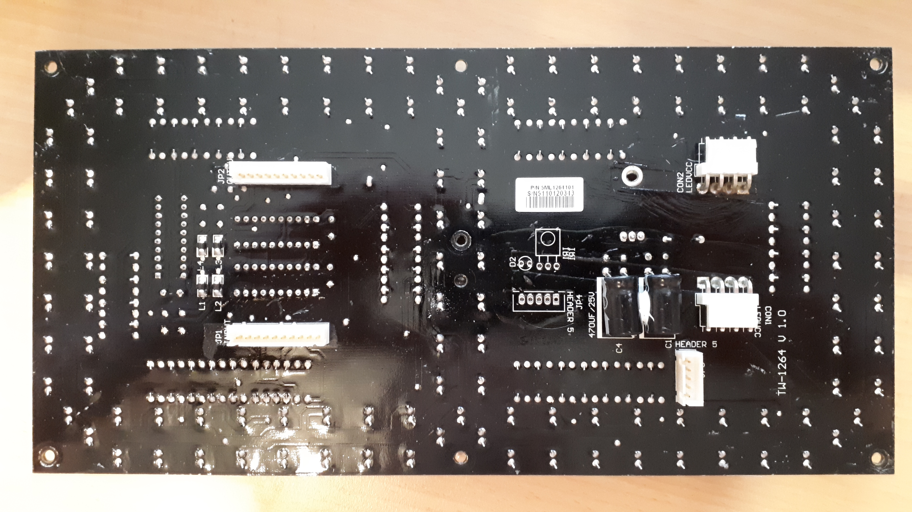
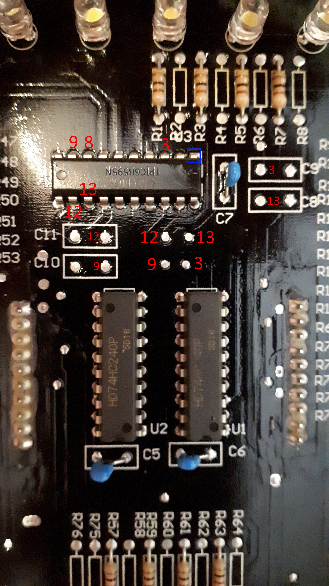
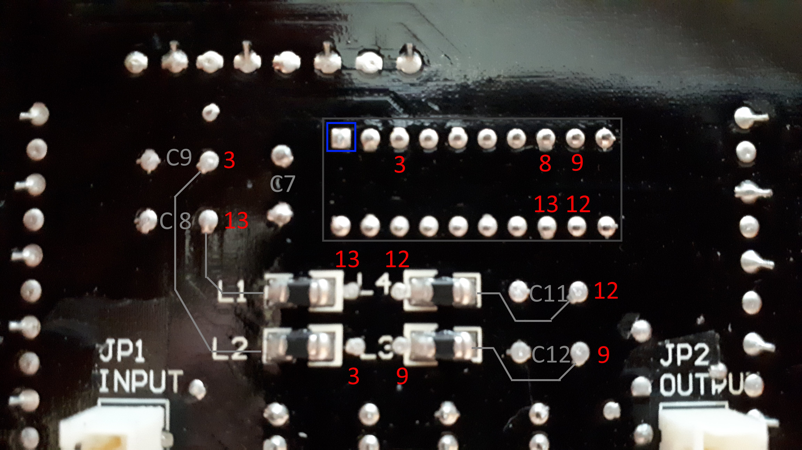

Vorderseite
===

Auf der Vorderseite ist deutlich zu erkennen, dass es sich um eine 7-Segment-Anzeige handelt.

Die Platine ist schwarz lackiert und an einigen Stellen ausgebessert, weshalb das Nachverfolgen der Leiterbahnen nicht ganz einfach ist.

Rückseite
===

Auf der Rückseite gibt es fünf Anschlüsse, `CON1`, `CON2`, `JP1`, `JP2` und `JP3` sowie einen unbestückten `JP4`.

Der Verbinder `CON1` ist mit `LEDVCC` beschriftet und liefert daher vermutlich die Spannung für die LEDs. Es scheint, als seien von den 4 Kontakten jeweils zwei zusammengeschaltet. Das quadratische Lötpad kennzeichnet normalerweise die Plusseite.

Der 10-polige Verbinder `JP1` ist mit `INPUT` beschriftet, ist also ein Eingang. Passend dazu gibt es auch den ebenfalls 10-poligen `JP2`, der als `OUTPUT` beschriftet ist.

Da es einen Eingang und einen Ausgang gibt, könnte es sein, dass die einzelnen Ziffern hintereinander geschaltet werden können. In diesem Fall wäre `CON2`, der ebenfalls mit `LEDVCC` beschriftet ist, vielleicht der Ausgang, mit dem die Spannung an das nächste Modul übergeben werden kann.

Auf der Vorderseite ist ein Spannungsregler vom Typ `LM7805` aufgelötet. Seine Eingangsspannung liegt zwischen 7 und 25 V, seine Ausgangsspannung bei 5 V.

Weiterhin gibt es zwei Chips vom Typ `HD74HC240P`. Es handelt sich um einen Puffer. Die Versorgungsspannung beträgt 2 V bis 6 V. Das passt zum Spannungsregler.

Dann gibt es noch einen `TPIC6B595N`. Das ist ein 8 Bit Schieberegister, der serielle Daten in parallele Ausgänge umwandelt. Seine Versorgungsspannung liegt bei max. 5,5 V, was ebenfalls zum Spannungswandler passt.

Aufgrund der ermittelten Spannungen der Chips liegt es nahe, dass die Spannungsversorgung eher mit 7V erfolgen kann als mit 25 V.

Bei 7*16 LEDs à 20 mA fließt ein Strom von ca. 2,2 A, falls alle LEDs gleichzeitig leuchten (Ziffer 8). Dafür ist der Spannungsregler aber nicht ausgelegt. Es gibt mehrere Möglichkeiten, wie die Stromaufnahme begrenzt werden kann. Bei einer maximalen Belastung von 1 A könnten die LEDs gleichzeitig mit 9 mA betrieben. Ansonsten kann ein Multiplexing-Verfahren angewendet werden, so dass die einzelnen Segmente nacheinander leuchten.

Seriell-Wandler
===

Laut [Datenblatt  des `TPIC6B595N`](tpic6b595.pdf) sollten wir vielleicht 5 Pins finden, um das Modul anzusteuern:

* `RCK` (Pin 12) zur Aktivierung der Datenübertragung
* `SRCK` (Pin 13) als Clock für die serielle Datenübertragung * `SERIN` (Pin 3) zur Dateneingabe
* `G` (Pin 9) zum Aktivieren des Chips
* `SRCLR` (Pin 8) um alle Bits zu löschen

Leider ist keiner dieser Pins mit einem Anschluss (`JPx`) verbunden.

Mit dem Multimeter habe ich jedoch folgende Verbindungen gefunden:

Puffer
===

Mit dem Durchgangsprüfer sind folgende Verbindungen zum Pufferchip ([Datenblatt HD74HC240P](hd74hc240p.pdf)) zu erkennen:

Input JP1 Pin 1 - U1 Pin 1 (`GND`), 10 (`1G`) und 19 (`2G`)
Input JP1 Pin 2 - U1 Pin 2 (`1A1`)
Input JP1 Pin 3 - U1 Pin 6 (`1A3`)
Input JP1 Pin 4 - U1 Pin 4 (`1A2`)
Input JP1 Pin 5 - N/V
Input JP1 Pin 6 - N/V
Input JP1 Pin 7 - U1 Pin 8 (`1A4`)
Input JP1 Pin 8 - N/V
Input JP1 Pin 9 - N/V
Input JP1 Pin 10 - U1 Pin 1 (`GND`), 10 (`1G`) und 19 (`2G`)

Output JP2 Pin 1 - U2 Pin 1 (`GND`), 10 (`1G`) und 19 (`2G`)
Output JP2 Pin 2 - U2 Pin 3 (`2Y4`)
Output JP2 Pin 3 - U2 Pin 7 (`2Y2`)
Output JP2 Pin 4 - U2 Pin 5 (`2Y3`)
Output JP2 Pin 5 - N/V
Output JP2 Pin 6 - N/V
Output JP2 Pin 7 - U2 Pin 9 (`2Y1`)
Output JP2 Pin 8 - N/V
Output JP2 Pin 9 - N/V
Output JP2 Pin 10 - U2 Pin 1 (`GND`), 10 (`1G`) und 19 (`2G`)

Es erscheint sinnig, dass auf `JP1` lauter Eingänge `A` und auf `JP2` lauter Ausgänge `Y` belegt sind.

Es scheint als lägen bei beiden Puffern `G1` und `G2` dauerhaft auf `GND`, womit der dritte Ausgangsstatus (`Z`, high impedance) nie benutzt wird. Somit wird der Eingang `A` immer invertiert an den Ausgang `Y` übergeben.

